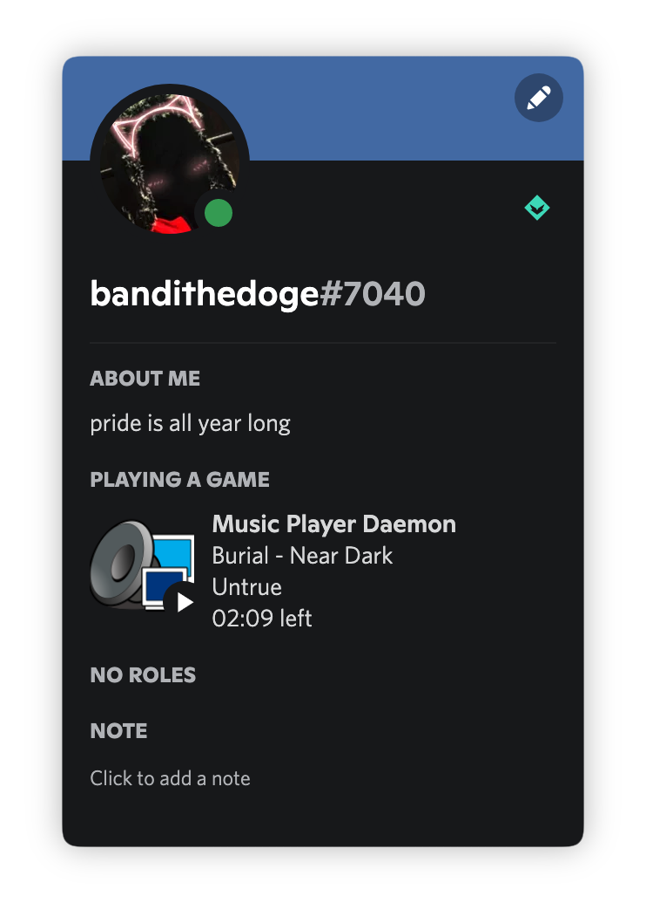

<div align="center">

# mpdcord



</div>

```console
usage: mpdcord [-h|--help] [-v|--verbose]

               Discord Rich Presence for MPD written in Go

Arguments:

  -h  --help     Print help information
  -v  --verbose  Output additional information, useful for debugging. Default:
                 false
```

## Installation

You can install `mpdcord` on any distro/OS by building it yourself with [Go](https://go.dev/doc/install). This will install the binary to `$GOPATH/bin/mpdcord` (defaults to `~/go/bin/mpdcord`), so make sure it's in your `$PATH`.

```bash
# latest stable
go install github.com/bandithedoge/mpdcord

# latest unstable
go install github.com/bandithedoge/mpdcord@latest
```

## Configuration

Everything is configured in a TOML file located at `$XDG_CONFIG_HOME/mpdcord.toml` (defaults to `~/.config/mpdcord.toml`). Here is an example configuration populated with default values:

```toml
# Note: keys are not case-sensitive.

# Discord API application ID, use this to customize title and images
ID = 922175995828654100
# Where to connect to MPD
Address = "localhost:6600"
# How to connect to MPD
Network = "tcp"
# Optional MPD password
Password = ""

# Formatting is done using strings with keys wrapped in curly braces, for example: "{title}"
# See below for all available keys
[Format]
  # First line
  Details = "{title}"
  # Second line
  State = "{artist}"
  # Text to display above the large image
  LargeText = "{album}"
  # Text to display above the small image
  SmallText = "{state}"
  # Time display mode:
  #   - true: "XX:XX left"
  #   - false: "XX:XX elapsed"
  Remaining = false
  # What to do when paused
  #   - true: Display nothing
  #   - false: Act normally (show all the metadata and a "pause" icon)
  PlayingOnly = false
```

<details>
<summary>All available keys</summary>

-   `album`: the album name.
-   `albumartist`: on multi-artist albums, this is the artist name which shall be used for the whole album. The exact meaning of this tag is not well-defined.
-   `albumartistsort`: same as albumartist, but for sorting.
-   `albums`: number of albums
-   `albumsort`: same as album, but for sorting.
-   `artist`: the artist name. Its meaning is not well-defined; see “composer” and “performer” for more specific tags.
-   `artists`: number of artists
-   `artistsort`: same as artist, but for sorting. This usually omits prefixes such as “The”.
-   `audio`: The format emitted by the decoder plugin during playback, format: samplerate:bits:channels. See Global Audio Format for a detailed explanation.
-   `bitrate`: instantaneous bitrate in kbps
-   `comment`: a human-readable comment about this song. The exact meaning of this tag is not well-defined.
-   `composer`: the artist who composed the song.
-   `composersort`: same as composer, but for sorting.
-   `conductor`: the conductor who conducted the song.
-   `consume`: 0 or 1
-   `date`: the song’s release date. This is usually a 4-digit year.
-   `db_playtime`: sum of all song times in the database in seconds
-   `db_update`: last db update in UNIX time (seconds since 1970-01-01 UTC)
-   `disc`: the decimal disc number in a multi-disc album.
-   `duration`: Duration of the current song in seconds.
-   `elapsed`: Total time elapsed within the current song in seconds, but with higher resolution.
-   `ensemble`: the ensemble performing this song, e.g. “Wiener Philharmoniker”.
-   `error`: if there is an error, returns message here
-   `genre`: the music genre.
-   `grouping`: “used if the sound belongs to a larger category of sounds/music” (from the IDv2.4.0 TIT1 description).
-   `label`: the name of the label or publisher.
-   `location`: location of the recording, e.g. “Royal Albert Hall”.
-   `mixrampdb`: mixramp threshold in dB
-   `mixrampdelay`: mixrampdelay in seconds
-   `mood`: the mood of the audio with a few keywords.
-   `movement`: name of the movement, e.g. “Andante con moto”.
-   `movementnumber`: movement number, e.g. “2” or “II”.
-   `musicbrainz_albumartistid`: the album artist id in the MusicBrainz database.
-   `musicbrainz_albumid`: the album id in the MusicBrainz database.
-   `musicbrainz_artistid`: the artist id in the MusicBrainz database.
-   `musicbrainz_releasetrackid`: the release track id in the MusicBrainz database.
-   `musicbrainz_trackid`: the track id in the MusicBrainz database.
-   `musicbrainz_workid`: the work id in the MusicBrainz database.
-   `name`: a name for this song. This is not the song title. The exact meaning of this tag is not well-defined. It is often used by badly configured internet radio stations with broken tags to squeeze both the artist name and the song title in one tag.
-   `nextsong`: playlist song number of the next song to be played
-   `nextsongid`: playlist songid of the next song to be played
-   `originaldate`: the song’s original release date.
-   `partition`: the name of the current partition (see Partition commands)
-   `performer`: the artist who performed the song.
-   `playlist`: 31-bit unsigned integer, the playlist version number
-   `playlistlength`: integer, the length of the playlist
-   `playtime`: time length of music played
-   `random`: 0 or 1
-   `repeat`: 0 or 1
-   `single`: 0, 1, or oneshot 6
-   `song`: playlist song number of the current song stopped on or playing
-   `songid`: playlist songid of the current song stopped on or playing
-   `songs`: number of songs
-   `state`: play, stop, or pause
-   `time`: total time elapsed (of current playing/paused song) in seconds (deprecated, use elapsed instead)
-   `title`: the song title.
-   `track`: the decimal track number within the album.
-   `updating_db`: job id
-   `uptime`: daemon uptime in seconds
-   `volume`: 0-100 (deprecated: -1 if the volume cannot be determined)
-   `work`: “a work is a distinct intellectual or artistic creation, which can be expressed in the form of one or more audio recordings”
-   `xfade`: crossfade in seconds (see Cross-Fading)

</details>

> Configuration keys and their default values are defined in [`defaults.go`](defaults.go)

## TODO

-   [ ] Don't reconnect to Discord at every status change
-   [ ] Figure out dynamically changing album covers (will definitely require a custom app ID)
